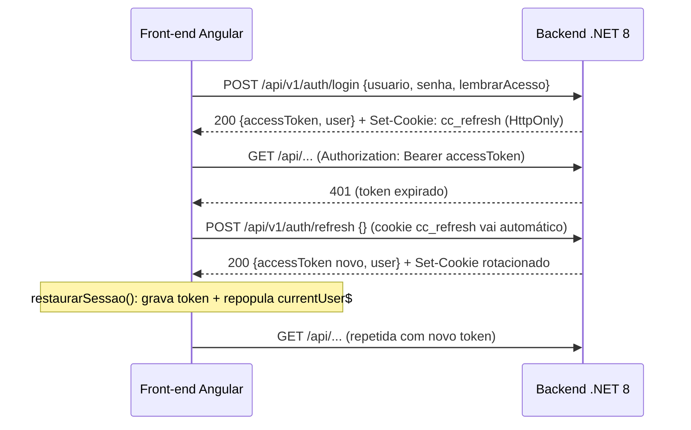

# Autenticação JWT — Integração com Backend ASP.NET Core 8

> Documento de referência da integração de autenticação do **Central de Operação**
> (Angular 18 + ASP.NET Core 8). Os endpoints descritos já estão **implementados**
> no backend (`backend/Central_BackEnd/`, no monorepo
> `CENTRALOPERACAO_DEPLOY`) e consumidos pelo front-end.
>
> **Versionamento de API**: todos os endpoints usam prefixo `/api/v1/` (segmento de URL ou header
> `X-Api-Version`). Pacote `Asp.Versioning.Mvc` adicionado ao backend.
> **Swagger**: habilitado/desabilitado via `SwaggerEnabled` em `appsettings.json` (padrão `false`
> em produção, `true` em `Development`). Sobrescrevível via variável de ambiente `SwaggerEnabled=true`.
> Última revisão: **25/08/2026** — a resposta do `POST /auth/refresh` agora documenta o campo `user`,
> consumido pelo front para restaurar a sessão após F5/401 (BUG 5). Revisões anteriores
> (21/08/2026): versionamento de API `/api/v1/`, Swagger toggle, lazy loading, Bootstrap SCSS parcial.

---

## 1. Visão Geral

- **Front-end**: Angular 18 (standalone) — estrutura JWT.
- **Backend**: ASP.NET Core 8 (Web API), em `backend/Central_BackEnd/`.
- **Autenticação**: Bearer Token (JWT) com **Refresh Token** rotativo.
- **Modo mock**: **removido**. O flag `environment.useMockAuth` não é mais consumido
  (os dois environments usam `false`) — o login sempre chama o backend real.

| Configuração | Valor |
|---|---|
| `environment.apiBaseUrl` (dev) | `http://localhost:1009/api` |
| `environment.apiBaseUrl` (prod) | `http://192.168.2.130:1009/api` |
| Tempo de vida do access token | 4 horas (`Jwt:AccessTokenMinutes` = 240, ajustável) |
| Tempo de vida do refresh token | 4 horas (`Jwt:RefreshTokenHours` = 4), **rotativo** |
| Chave de assinatura JWT | `JWT_KEY` (variável de ambiente) → fallback `Jwt:Key` |
| Armazenamento do refresh token | **Cookie HttpOnly `cc_refresh`** (nunca no `localStorage`) |
| Armazenamento do access token | **Somente memória** no front |

> **Sessão após 4h**: quando o access token expira (4h), o refresh também já expirou — a renovação
> falha e o usuário é deslogado, precisando autenticar novamente.
> **"Lembrar meu acesso"** (marcado por padrão) → o cookie `cc_refresh` recebe `MaxAge` de 4h e a
> sessão sobrevive a reloads/reaberturas do navegador; desmarcado → cookie de sessão, que se perde
> ao fechar o navegador. Senhas **nunca** são persistidas.

---

## 2. Endpoints Implementados

### 2.1. `POST /api/v1/auth/login`

Autentica o usuário e retorna os tokens.

**Requisição:**
```json
{
  "usuario": "fulano.silva",
  "senha": "senha-secreta",
  "lembrarAcesso": true
}
```

**Resposta 200:**
```json
{
  "accessToken": "eyJhbGciOiJIUzI1NiIs...",
  "expiraEmSegundos": 14400,
  "user": {
    "id": "FULANO",
    "nome": "Fulano da Silva",
    "email": "fulano.silva@jcasolucoes.com.br",
    "perfil": "Administrador"
  }
}
```
> O campo `refreshToken` **não** vem mais no corpo: o refresh token é entregue via
> **cookie HttpOnly `cc_refresh`** no `Set-Cookie` da resposta.

**Erros:**
| Status | Corpo |
|---|---|
| 401 | `{ "mensagem": "Usuario ou senha invalidos." }` |
| 400 | `{ "mensagem": "Campos obrigatorios ausentes." }` |
| 429 | Rejeição do rate limiter (`Too Many Requests`) |

**Observações:**
- O campo `usuario` aceita e-mail ou login (`OPERADOR_ID`).
- `lembrarAcesso: true` → cookie `cc_refresh` com `MaxAge` de 4h (+ marcador `cc_lembrar`); `false`
  → cookie de sessão (sem `MaxAge`).
- **Rate limiting**: no máximo **5 tentativas/min por IP** (`política "login"`).
- **Lockout** (`BruteForceGuard`): 5 falhas em 5 min para o mesmo operador → bloqueio de **15 min**.

### 2.2. `POST /api/v1/auth/refresh`

Renova o access token usando o refresh token (**rotativo**: o antigo é revogado e um novo é emitido)
e devolve também os dados do usuário.

**Requisição:** sem corpo. O refresh token é lido do **cookie `cc_refresh`** (enviado automaticamente).

**Resposta 200:**
```json
{
  "accessToken": "eyJhbGciOiJIUzI1NiIs...",
  "expiraEmSegundos": 14400,
  "user": {
    "id": "FULANO",
    "nome": "Fulano da Silva",
    "email": "fulano.silva@jcasolucoes.com.br",
    "perfil": "Administrador"
  }
}
```
> O campo `user` **sempre vem preenchido**: `AuthService.RefreshAsync` retorna o DTO `TokenResponse`
> com `User` reconstruído do banco. No front, a interface `RefreshTokenResponse` o declara como
> opcional (`user?: Usuario`) apenas por defensividade — se vier vazio, o `AuthService` reconstrói o
> usuário pelas claims do próprio JWT (`decodificarToken()`).

**Erros:**
| Status | Corpo |
|---|---|
| 401 | `{ "mensagem": "Refresh token invalido ou expirado." }` (cookie também é removido) |

**Regras:**
- Aceitar o refresh token **uma única vez** (rotativo): o token usado é revogado (`Revogado = true`)
  e o novo é registrado com hash (`SubstituidoPor`).
- O cookie é **regravado a cada rotação**; se o marcador `cc_lembrar` estiver presente (usuário optou
  por "Lembrar meu acesso"), o novo cookie mantém `MaxAge` de 4h, senão volta a ser cookie de sessão.
- Após a reformulação, o refresh não recebe mais o token no body.
- O objeto `user` da resposta é usado pelo front (`AuthService.restaurarSessao()`, chamado no
  single-flight) para repopular o usuário em memória após **F5 (guard)**, **retry pós-401
  (interceptor)** e na **verificação periódica de 5 min**.

### 2.3. `POST /api/v1/auth/logout`

Revoga o refresh token ativo e encerra a sessão. **Com `[Authorize]`** — revoga o token lido do cookie
e **remove** os cookies `cc_refresh`/`cc_lembrar`.

**Requisição:** sem corpo.

**Resposta:** `204 No Content`

### 2.4. `GET /api/v1/auth/me`

Retorna os dados do usuário da sessão atual. **Requisição autenticada** (Bearer).

**Resposta 200:**
```json
{
  "id": "FULANO",
  "nome": "Fulano da Silva",
  "email": "fulano.silva@jcasolucoes.com.br",
  "perfil": "Administrador"
}
```

### 2.5. `POST /api/v1/auth/forgot-password` (sugerido)

Solicita redefinição de senha (e-mail com link/one-time code).

```json
{ "usuario": "fulano.silva@jcasolucoes.com.br" }
```

> ⚠️ **Não implementado** — fica como sugestão/roadmap.

---

## 3. Claims do JWT

O front-end lê `exp` para controlar a expiração local (`isAuthenticated()`) e — como salvaguarda —
`sub`/`name`/`email`/`perfil` para reconstruir o usuário quando o refresh devolve resposta sem o
objeto `user` (`AuthService.restaurarSessao()` → `decodificarToken()`). O backend emite:

| Claim | Descrição |
|---|---|
| `sub` | ID do usuário (`OPERADOR_ID`) |
| `name` | Nome completo |
| `email` | E-mail corporativo |
| `perfil` | `Administrador` \| `Suporte` \| `Usuario` |
| `role` | Mesmo valor do `perfil` (mapeado para `ClaimTypes.Role`) — pronto para `[Authorize(Roles=...)]` |
| `iat` | Emissão (epoch) |
| `exp` | Expiração (epoch) |

> O backend gera `Administrador` (`SE_ADMIN`/`PERFIL_ID="A"`), `Suporte`
> (`PERFIL_ID="S"`) ou `Usuario` (fallback). O perfil `Editor` não é gerado.

---

## 4. Guia de Implementação — ASP.NET Core 8

### 4.1. `Program.cs` (resumo do que está implementado)

```csharp
using System.Security.Claims;
using System.Text;
using System.Threading.RateLimiting;
using Microsoft.AspNetCore.Authentication.JwtBearer;
using Microsoft.AspNetCore.RateLimiting;
using Microsoft.IdentityModel.Tokens;

var builder = WebApplication.CreateBuilder(args);

var jwtSettings = builder.Configuration.GetSection("Jwt");
var jwtKey = Environment.GetEnvironmentVariable("JWT_KEY")
    ?? jwtSettings["Key"]
    ?? throw new InvalidOperationException("JWT_KEY ou Jwt:Key nao configurada.");
var key = Encoding.UTF8.GetBytes(jwtKey);

builder.Services.AddControllers();

builder.Services.AddAuthentication(JwtBearerDefaults.AuthenticationScheme)
    .AddJwtBearer(options =>
    {
        options.TokenValidationParameters = new TokenValidationParameters
        {
            ValidateIssuer = true,
            ValidateAudience = true,
            ValidateLifetime = true,
            ValidateIssuerSigningKey = true,
            RequireExpirationTime = true,
            ValidAlgorithms = new[] { SecurityAlgorithms.HmacSha256 },
            ValidIssuer = jwtSettings["Issuer"],
            ValidAudience = jwtSettings["Audience"],
            IssuerSigningKey = new SymmetricSecurityKey(key),
            ClockSkew = TimeSpan.FromMinutes(1)
        };
    });

builder.Services.AddAuthorization();
builder.Services.AddSingleton<BruteForceGuard>();

builder.Services.AddRateLimiter(options =>
{
    options.RejectionStatusCode = StatusCodes.Status429TooManyRequests;
    // "login"       → 5/min por IP
    // "validacao"   → 5/min por usuário autenticado
});

// CORS com AllowCredentials() para o cookie cross-origin (front :1010 → back :1009)
builder.Services.AddCors(options =>
{
    options.AddPolicy("Angular", policy => policy
        .WithOrigins("http://192.168.2.130:1010", "http://localhost:4200", "http://localhost:1010")
        .AllowAnyHeader().AllowAnyMethod().AllowCredentials());
});

var app = builder.Build();
app.UseRouting();
app.UseRateLimiter();
app.UseCors("Angular");
app.UseAuthentication();
app.UseAuthorization();
app.MapControllers();
app.Run();
```

### 4.2. `appsettings.json` (exemplo sanitizado — ver `appsettings.sample.json`)

```json
{
  "Jwt": {
    "Key": "SUA_CHAVE_SECRETA_JWT_LONGA",
    "Issuer": "CentralConhecimento",
    "Audience": "CentralConhecimentoFront",
    "AccessTokenMinutes": 240,
    "RefreshTokenHours": 4
  }
}
```

> ⚠️ Nunca versionar a chave real. O código **prioriza a variável de ambiente `JWT_KEY`**
> (definível no IIS) e só cai no `Jwt:Key` do `appsettings.json` (do servidor) como fallback.

### 4.3. `SegurancaHelper` (comparação de senha em tempo constante)

A senha legada do `TBOPERADOR` segue em texto puro (sem alteração de banco), mas a comparação
é feita sobre o **SHA-256** de ambas as partes, evitando vazamento por *timing* e diferença de tamanho:

```csharp
public static bool SenhasIguais(string? a, string? b)
{
    var ha = SHA256.HashData(Encoding.UTF8.GetBytes(a ?? string.Empty));
    var hb = SHA256.HashData(Encoding.UTF8.GetBytes(b ?? string.Empty));
    var diff = 0;
    for (var i = 0; i < ha.Length; i++)
    {
        diff |= ha[i] ^ hb[i];
    }
    return diff == 0;
}
```

### 4.4. `AuthController` — cookies de refresh (esqueleto)

```csharp
private const string CookieRefresh = "cc_refresh";
private const string CookieLembrar = "cc_lembrar";

[HttpPost("login")]
[EnableRateLimiting("login")]
public async Task<ActionResult<TokenResponse>> Login(LoginRequest request)
{
    var resultado = await _authService.LoginAsync(request);
    if (resultado is null)
        return Unauthorized(new { mensagem = "Usuario ou senha invalidos." });

    GravarCookieRefresh(resultado.RefreshToken, request.LembrarAcesso);
    resultado.RefreshToken = string.Empty;   // não vai no body
    return Ok(resultado);
}

[HttpPost("refresh")]
public async Task<ActionResult<TokenResponse>> Refresh()
{
    var refreshToken = Request.Cookies[CookieRefresh];
    if (string.IsNullOrWhiteSpace(refreshToken))
        return Unauthorized(new { mensagem = "Refresh token invalido ou expirado." });

    var resultado = await _authService.RefreshAsync(refreshToken);
    if (resultado is null)
    {
        LimparCookieRefresh();
        return Unauthorized(new { mensagem = "Refresh token invalido ou expirado." });
    }

    var persistente = Request.Cookies[CookieLembrar] == "1";
    GravarCookieRefresh(resultado.RefreshToken, persistente);
    resultado.RefreshToken = string.Empty;
    return Ok(resultado);
}

[HttpPost("logout")]
[Authorize]
public async Task<IActionResult> Logout()
{
    var refreshToken = Request.Cookies[CookieRefresh];
    if (!string.IsNullOrWhiteSpace(refreshToken))
        await _authService.RevogarRefreshTokenAsync(refreshToken);
    LimparCookieRefresh();
    return NoContent();
}
```

Cookie definido como:
```csharp
new CookieOptions
{
    HttpOnly = true,
    SameSite = SameSiteMode.Strict,
    Secure = false,          // intranet http; habilitar quando houver HTTPS
    Path = "/"
};
// persistente → opcoes.MaxAge = TimeSpan.FromHours(4)
```

### 4.5. Fluxo no front-end (com cookie)



**Comportamento implementado no front (`auth.interceptor.ts` / `auth.guard.ts`):**
1. Todas as requisições usam `withCredentials: true` (habilita o cookie cross-origin 1010↔1009).
2. Requisições de `*/auth/*` não recebem Bearer (exceto no retry pós-401).
3. Ao receber **401**: aciona `refreshTokenSingleFlight()` — chamadas simultâneas aguardam a mesma renovação.
4. Sucesso → `restaurarSessao(response)` grava o novo access token e **repopula o usuário**
   (`tokenStorage.setUsuario()` + `currentUser$`, usando o `user` devolvido pelo refresh); em seguida
   repete a requisição original com o token novo.
5. Falha → `logout()` limpa memória; `auth.guard.ts` redireciona para `/login` com `returnUrl`.
6. `AuthService.logout()` chama `POST /api/v1/auth/logout` (cookie revogado/apagado no servidor).
7. No reload (**F5**), o access token e o usuário (que eram só memória) foram perdidos → o guard tenta o
   **refresh silencioso** via cookie; além do token, o **usuário é restaurado** e o perfil do header volta
   a renderizar. Se não houver cookie válido, volta para o login.
8. A **verificação periódica de 5 min** (`verificarSessao()`) também passa pelo mesmo single-flight e
   repopula o usuário a cada renovação antecipada.
9. Se `response.user` vier vazio no refresh, o usuário é reconstruído das claims do JWT
   (`decodificarToken()`: `sub`/`name`/`email`/`perfil`). O endpoint `GET /auth/me` existe, mas não é
   necessário para essa restauração.

---

## 5. Segurança — Estado atual

- [x] Hash do refresh token no banco (SHA-256); nunca armazenado em texto puro.
- [x] **Refresh token em cookie `HttpOnly`** (não fica no `localStorage`); access token só em memória.
- [x] Rotação do refresh token — o token usado é revogado e o novo é registrado (`SubstituidoPor`).
- [x] **Rate limiting** em `/api/v1/auth/login` (5/min por IP) e nas rotas sensíveis de acessos (`validacao`).
- [x] **Lockout** após 5 tentativas inválidas em 5 min (bloqueio de 15 min) — `BruteForceGuard`.
- [x] **Comparação de senha em tempo constante** (`SegurancaHelper`) — mitigação enquanto o banco
      legado mantém senha em texto puro.
- [x] CORS restrita às origens da aplicação + `AllowCredentials()` (cookie cross-origin).
- [x] JWT com `RequireExpirationTime` + `ValidAlgorithms = HS256`; chave via `JWT_KEY`.
- [ ] **Detecção de reuso do refresh token** (revogar a cadeia inteira) — **não implementado**; hoje o token reutilizado é apenas revogado.
- [ ] HTTPS obrigatório em produção (`UseHttpsRedirection`) e `Secure` no cookie — **não implementado** (intranet http; apenas `UseHsts`).
- [ ] Migração de `TBOPERADOR` para `BCrypt`/`Argon2` — **pendente** (sem alteração de banco por ora).
- [ ] Auditoria de login, logout e refresh — **pendente** (só a visualização de acessos é auditada).